<div align="center">



<br/>

[](https://novariyaz.github.io/Gravity-LAB/)
[](https://developer.mozilla.org/en-US/docs/Web/API/Canvas_API)
[](https://developer.mozilla.org/en-US/docs/Web/JavaScript)
[](https://developer.mozilla.org/en-US/docs/Web/CSS)
[](LICENSE)

<br/>

```
g(φ,h) = 9.780327 × (1 + 0.0053024sin²φ − 0.0000058sin²2φ) × (1 − 2h/R)
```

*Your exact gravitational acceleration — calculated from real GPS coordinates*

</div>

---

## ⚡ What Is Gravity LAB?

**Gravity LAB** is a premium, fully interactive gravitational physics explorer built with pure HTML, CSS, and JavaScript — zero frameworks, zero dependencies.

It calculates your **real local gravity** using the Somigliana geodetic formula based on your GPS latitude and altitude, then lets you explore gravity through live physics simulations, solar system comparisons, and stunning canvas-rendered visuals.

> 🏆 **Portfolio Project** — Built to demonstrate Canvas API mastery, physics simulation, geolocation APIs, and premium UI/UX design.

---

## 🎮 Features

### 🌍 Real Gravity Detection
- Uses browser **Geolocation API** to get your exact coordinates
- Applies the **Somigliana geodetic formula** — the same model used by scientists
- Gravity varies by latitude (poles stronger), altitude (higher = weaker), and local geology
- Reverse geocodes your city name using OpenStreetMap Nominatim

### 🪐 Canvas-Rendered Solar System
Every planet is **drawn with Canvas API** — no emoji fallbacks:

| Planet | Special Detail |
|--------|---------------|
| 🌑 Mercury | Realistic crater markings |
| 🟡 Venus | Amber cloud atmosphere |
| 🌍 Earth | Continent shapes + ocean |
| 🌕 Moon | Crater surface detail |
| 🔴 Mars | Rust surface texture |
| 🟠 Jupiter | Cloud bands + Great Red Spot |
| 🪐 Saturn | Rendered ring system |
| 🔵 Uranus | Sideways ring system |
| 💙 Neptune | Dark storm system |
| ⚪ Pluto | Heart region surface |

### 🔬 4 Physics Simulations

```
┌──────────────────┬──────────────────────────────────────────┐
│  SIMULATION      │  DESCRIPTION                             │
├──────────────────┼──────────────────────────────────────────┤
│  Gravity Well    │  N-body particle simulation. Click to    │
│                  │  spawn masses. Drag to create black holes │
├──────────────────┼──────────────────────────────────────────┤
│  Free Fall       │  Drop objects from any height on any     │
│                  │  planet. Real velocity vectors + trails   │
├──────────────────┼──────────────────────────────────────────┤
│  Orbital         │  Multi-satellite orbits around a star.   │
│  Mechanics       │  Adjust mass & velocity in real-time     │
├──────────────────┼──────────────────────────────────────────┤
│  Pendulum        │  Drag the bob with your mouse. Period     │
│                  │  changes live with gravity & length       │
└──────────────────┴──────────────────────────────────────────┘
```

### ✨ Motion & Interactive UI
- **Custom cursor** with glowing ring trail
- **Magnetic buttons** that physically follow your mouse
- **3D tilt** on every planet card (perspective transform on hover)
- **Click ripple** effect anywhere on screen
- **Particle orb** — 90 orbiting particles react to your mouse
- **Animated starfield** with twinkling stars and drifting nebulae
- **Scroll-reveal** staggered animations on facts section
- **Noise texture + CRT scanlines** overlay for sci-fi atmosphere
- **Glitch text** effect on main title
- **Preloader** with physics status messages

### 🧮 Mass Calculator
- Enter your weight in **kg or lbs**
- See your gravitational force in **Newtons** at your exact location
- Compare your weight across every planet in the solar system in real-time

---

## 🖼️ Preview

<div align="center">

| Hero Section | Planet Comparison |
|:---:|:---:|
| *Animated starfield + gravity orb* | *Canvas-drawn planets with 3D tilt* |

| Gravity Well Sim | Pendulum Sim |
|:---:|:---:|
| *N-body particle physics* | *Drag-interactive pendulum* |

</div>

---

## 🚀 Quick Start

### Option 1 — Open Directly
```bash
# Just open in browser — no server needed!
open index.html
```

### Option 2 — Local Server (recommended for geolocation)
```bash
# Python
python -m http.server 8000

# Node.js
npx serve .

# Then open: http://localhost:8000
```

> ⚠️ **Note:** Geolocation requires HTTPS or localhost. Use a local server or deploy to GitHub Pages for full functionality.

---

## 📐 Physics Behind It

### Somigliana Geodetic Formula
```
g(φ) = ge × (1 + k·sin²φ) / √(1 − e²·sin²φ)

Where:
  ge  = 9.7803253359  (equatorial gravity)
  k   = 0.00193185265241
  e²  = 0.00669437999014
  φ   = latitude
```

### Altitude Correction
```
g(φ, h) = g(φ) × (1 − 2h/R)²

Where:
  h = altitude in meters
  R = 6,371,000 m (Earth's mean radius)
```

### Pendulum Period
```
T = 2π × √(L/g)

Where:
  T = period in seconds
  L = pendulum length in meters
  g = local gravity
```

---

## 🗂️ File Structure

```
gravity-lab/
│
├── index.html          # Entire app — single file, zero dependencies
├── banner.svg          # Animated README banner
├── README.md           # This file
└── LICENSE             # MIT License
```

---

## 🧪 Tech Stack

```
Language    │  HTML5 · CSS3 · Vanilla JavaScript (ES6+)
Rendering   │  Canvas 2D API
Physics     │  Custom engine (N-body, Newtonian gravity, RK integration)
Geolocation │  Browser Geolocation API + Nominatim reverse geocoding
Fonts       │  Google Fonts (Orbitron · Rajdhani · Share Tech Mono)
Hosting     │  GitHub Pages (free)
```

**No frameworks. No npm. No build step. One file.**

---

## 📊 Gravity Values Reference

| Location | g (m/s²) |
|----------|----------|
| North Pole | 9.8322 |
| Standard (mean) | 9.80665 |
| London, UK | 9.8119 |
| New York, USA | 9.8026 |
| Equator (sea level) | 9.7803 |
| Mount Everest | 9.7647 |
| ISS Orbit (~400km) | ~8.7 |
| Moon | 1.62 |
| Mars | 3.72 |
| Jupiter | 24.79 |

---

## 🌐 Deploy to GitHub Pages

```bash
# 1. Clone or download this repo
git clone https://github.com/novariyaz/gravity-lab.git
cd gravity-lab

# 2. Push to GitHub
git add .
git commit -m "feat: Gravity LAB v3 — interactive physics explorer"
git push origin main

# 3. Enable Pages:
#    GitHub repo → Settings → Pages → Source: main / root → Save
#    Live at: https://novariyaz.github.io/gravity-lab
```

---

## 🔮 Roadmap

- [ ] Augmented Reality mode (WebXR)
- [ ] Tidal force visualization
- [ ] Gravitational lensing simulation
- [ ] 3D solar system with WebGL
- [ ] Multiplayer gravity well (WebSockets)
- [ ] PWA support (offline mode)

---

## 📜 License

```
MIT License — free to use, modify, and distribute.
Built with pure web tech. No tracking. No ads. No dependencies.
```

---

<div align="center">

**Built by [Riyaz](https://github.com/novariyaz)**

*Part of a daily GitHub project challenge — building AI-powered and physics tools in public*

<br/>

[](https://github.com/novariyaz)
[](https://github.com/novariyaz/gravity-lab)

<br/>

*If this project helped you, drop a ⭐ — it helps other developers find it!*

<br/>

```
  ·  ·  ·  FEEL THE PULL  ·  ·  ·
```

</div>
